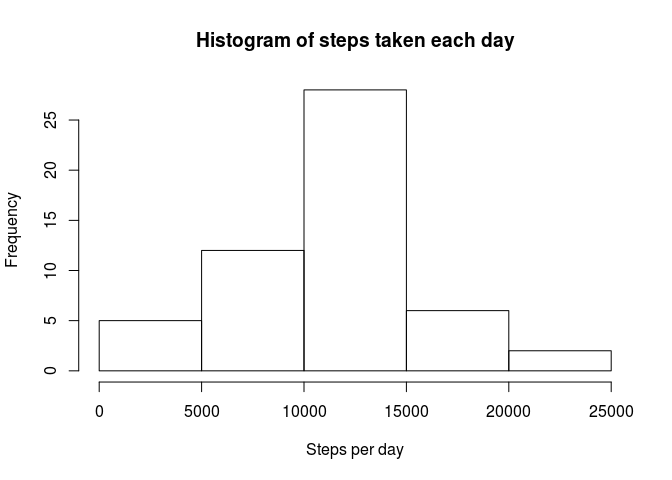
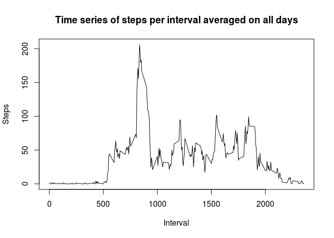
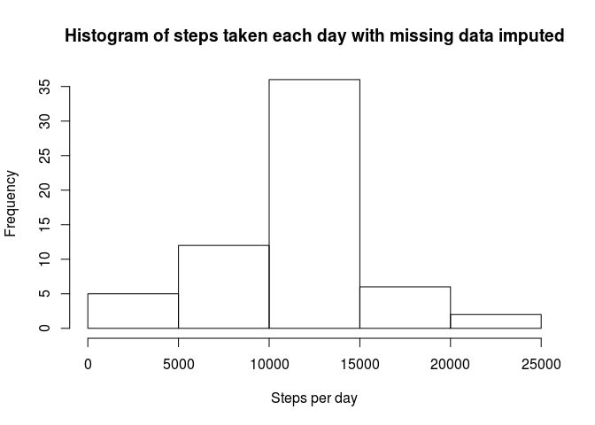
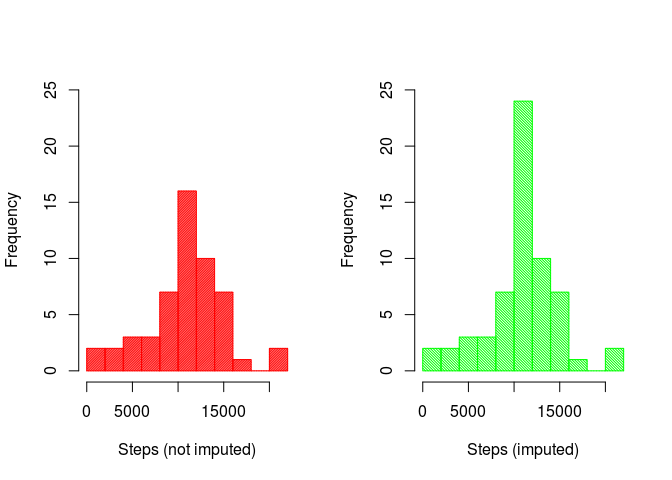
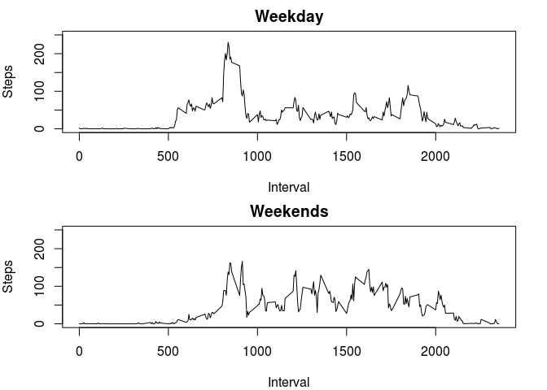

# Reproducible Research: Peer Assessment 1
Stefano Merlo  
02/10/2015  

### Introduction

It is now possible to collect a large amount of data about personal movement using activity monitoring devices such as a Fitbit, Nike Fuelband, or Jawbone Up. These type of devices are part of the “quantified self” movement – a group of enthusiasts who take measurements about themselves regularly to improve their health, to find patterns in their behavior, or because they are tech geeks. But these data remain under-utilized both because the raw data are hard to obtain and there is a lack of statistical methods and software for processing and interpreting the data.

This assignment makes use of data from a personal activity monitoring device. This device collects data at 5 minute intervals through out the day. The data consists of two months of data from an anonymous individual collected during the months of October and November, 2012 and include the number of steps taken in 5 minute intervals each day.

Let's answer some questions on this dataset

### Loading and preprocessing the data


```r
# set working directory, download file and read
setwd("/home/erpreciso/Documents/school/repdata-prj1")
if (!file.exists("raw")){
    dir.create("raw")
}
inputUrl <- "https://d396qusza40orc.cloudfront.net/repdata%2Fdata%2Factivity.zip"
temp <- tempfile()
download.file(inputUrl, temp, method="curl")
data <- read.csv(unz(temp, "activity.csv"))
unlink(temp)

# format date
data$date <- strptime(data$date, "%Y-%m-%d")

# create data frame without missing values
data.without.na <- data[!is.na(data$steps),]
```

## What is mean total number of steps taken per day?

Note: missing data in the dataset are ignored.

### Histogram of the total number of steps taken each day

```r
# aggregate data by date
steps.per.day <- data.frame(steps=data.without.na$steps,
                            date=data.without.na$date)
steps.per.day <- aggregate(steps ~ date, data=steps.per.day, FUN=sum)
hist(steps.per.day$steps, xlab="Steps per day", 
     main="Histogram of steps taken each day")
```

 

### Mean and median of the total number of steps taken per day

```r
# calculate median and mean
md <- round(median(steps.per.day$steps), 2)
mn <- round(mean(steps.per.day$steps), 2)
print(paste("Median of steps per day:", md, " "))
```

```
## [1] "Median of steps per day: 10765  "
```

```r
print(paste("Mean of steps per day:", mn, " "))
```

```
## [1] "Mean of steps per day: 10766.19  "
```

## What is the average daily activity pattern?


```r
# plot the steps per interval
steps.per.interval <- aggregate(steps ~ interval,
                                data=data.without.na, FUN=mean)
plot(steps.per.interval$interval, steps.per.interval$steps, type="l",
     main="Time series of steps per interval averaged on all days",
     ylab="Steps", xlab="Interval")
```

 

*Which 5-minute interval, on average across all the days in the dataset, contains the maximum number of steps?*

```r
# get interval of record with maximun number of steps
mx <- steps.per.interval[which.max(steps.per.interval$steps),"interval"]
print(paste("Interval containing max number of steps:", mx, " "))
```

```
## [1] "Interval containing max number of steps: 835  "
```

## Imputing missing values


```r
# calculate missing values count
missing <- sum(is.na(data$steps))
print(paste("Missing value count:", missing, " "))
```

```
## [1] "Missing value count: 2304  "
```

Impute missing values by replacing with mean of that interval in the days where is present (data frame *step.per.interval*) in a new data frame *imputed.data*


```r
# created new data frame imputed.data copying original data
imputed.data <- data

# replace missing with mean of that interval
for (i in seq_along(imputed.data$steps)){
    if (is.na(imputed.data$steps[i])){
        intv <- imputed.data$interval[i]
        n <- steps.per.interval[steps.per.interval$interval==intv, "steps"]
        imputed.data$steps[i] <- n
    }
}
```

### Histogram of the total number of steps taken each day with missing data imputed

```r
# aggregate data by date
imputed.steps.per.day <- data.frame(steps=imputed.data$steps,
                            date=imputed.data$date)
imputed.steps.per.day <- aggregate(steps ~ date, data=imputed.steps.per.day,
                                   FUN=sum)
hist(imputed.steps.per.day$steps, xlab="Steps per day", 
     main="Histogram of steps taken each day with missing data imputed")
```

 

### Mean and median of the total number of steps taken per day with missing data imputed

```r
# calculate median and mean
imputed.md <- round(median(imputed.steps.per.day$steps), 2)
imputed.mn <- round(mean(imputed.steps.per.day$steps), 2)
print(paste("Median of steps per day (missing data imputed):", imputed.md, " "))
```

```
## [1] "Median of steps per day (missing data imputed): 10766.19  "
```

```r
print(paste("Mean of steps per day (missing data imputed):", imputed.mn, " "))
```

```
## [1] "Mean of steps per day (missing data imputed): 10766.19  "
```

### Do these values differ from the estimates from the first part of the assignment?


```r
# calculate difference with mean and median without missing data
gap.median <- imputed.md - md
gap.mean <- imputed.mn - mn
t1 <- "Difference between median calculated with imputed missing data and not:"
t2 <- "Difference between mean calculated with imputed missing data and not:"
print(paste(t1, round(gap.median, 2), " "))
```

```
## [1] "Difference between median calculated with imputed missing data and not: 1.19  "
```

```r
print(paste(t2, round(gap.mean, 2), " "))
```

```
## [1] "Difference between mean calculated with imputed missing data and not: 0  "
```

### What is the impact of imputing missing data on the estimates of the total daily number of steps?


```r
# compare in qplot both frequency distribution
par(mfrow=c(1,2))
hist(steps.per.day$steps, breaks=10, col="red", main=NULL, ylim=c(0,25),
     density=80, xlab="Steps (not imputed)")
hist(imputed.steps.per.day$steps, breaks=10, col="green", main=NULL,
     ylim=c(0,25), density=50, angle=135, xlab="Steps (imputed)")
```

 

From the plot, imputed value are overall bigger than not imputed ones but have a very similar distribution, as suggested also by mean and median calulation.

## Are there differences in activity patterns between weekdays and weekends?


```r
# create variable weekday vs weekend
imputed.data$weekday <- weekdays(imputed.data$date)
for (i in seq_along(imputed.data$weekday)){
    if (imputed.data[i,"weekday"] %in% c("Saturday", "Sunday")){
        imputed.data$daytype[i] <- "weekend"
    } else {
        imputed.data$daytype[i] <- "weekday"
    }
}

# create two aggregation per daytype
steps.per.daytype <- aggregate(steps ~ daytype*interval,
                                data=imputed.data, FUN=mean)
weekday <- steps.per.daytype[steps.per.daytype$daytype=="weekday",]
weekend <- steps.per.daytype[steps.per.daytype$daytype=="weekend",]
par(mfrow=c(2,1))
par(mar=c(4,4,2,2))
plot(weekday$interval, weekday$steps, type="l",
     main="Weekday", ylab="Steps", xlab="Interval", ylim=c(0,250))
plot(weekend$interval, weekend$steps, type="l",
     main="Weekends", ylab="Steps", xlab="Interval", ylim=c(0,250))
```

 

From the plots it looks like during the weekend the activity is more distributed during the day.
